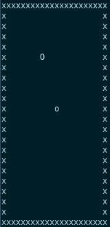

# README #
The terminal snake you always needed

# Clone repo #
`$ git clone https://github.com/sdaveas/snake.git`

# Build #
from repository directory, run:

`$ mkdir build && cd build && g++ ../src/*.cpp -o snake`

# Run #
from build directory, run:

`$ ./snake [dimension]`

# Instructions #
* Easy: Snake can pass through the walls.

* Hard: Snake crushes on the walls.

* Expert: Additional obstacles introduced.
